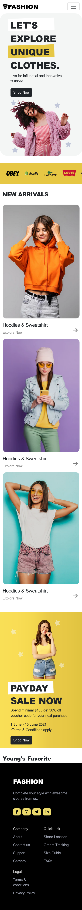

這是一個練習用網頁，網頁設計稿來自於 figma 用戶：Nickelfox Design。
來源：https://www.figma.com/community/file/1135871952737326157

網頁使用 React 建立，使用到 React Router、Hooks 等。
使用 git clone，並執行 npm install 下載相關套件，在運行 npm start 即可。

